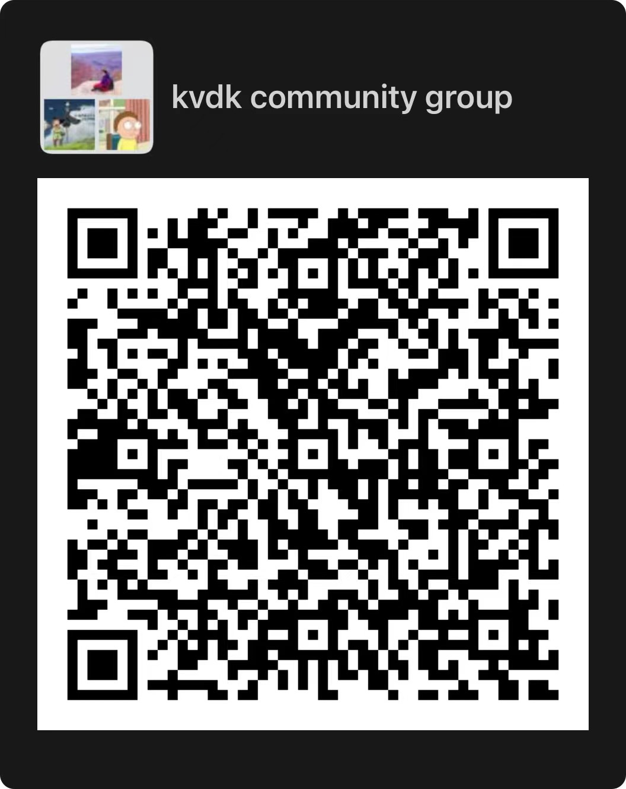

# **KVDK**

`KVDK` (Key-Value Development Kit) is a key-value store library implemented in C++ language. It is designed for persistent memory and provides unified APIs for both volatile and persistent scenarios. It also demonstrates several optimization methods for high performance with persistent memory. Besides providing the basic APIs of key-value store, it offers several advanced features, like transaction, snapshot.

## Features
*  The basic get/set/update/delete opertions on unsorted keys.
*  The basic get/set/update/delete/iterate operations on sorted keys.
*  Provide APIs to write multiple key-value pairs in an atomic batch.
*  User can create multiple collections of sorted keys.
*  Support read-committed transactions. (TBD)
*  Support snapshot to get a consistent view of data. (TBD)

# Limitations
*  Maximum supported key-value size is 64KB-64MB.
*  No support of changing the maximum access thread number after start-up.
*  No approval of key-value compression.
*  Users can't expand the persistent memory space in the fly.

## Getting the Source
```bash
git clone --recurse-submodules https://github.com/pmem/kvdk.git
```

## Building
### Install dependent tools and libraries on Ubuntu (18.04.6)
```bash
sudo apt install make clang-format-9 pkg-config g++ autoconf libtool asciidoctor libkmod-dev libudev-dev uuid-dev libjson-c-dev libkeyutils-dev pandoc libhwloc-dev libgflags-dev libtext-diff-perl

git clone https://github.com/pmem/ndctl.git
cd ndctl
git checkout v70.1
./autogen.sh
./configure CFLAGS='-g -O2' --prefix=/usr --sysconfdir=/etc --libdir=/usr/lib
make
sudo make install

git clone https://github.com/pmem/pmdk.git
cd pmdk
git checkout 1.11.1
make
sudo make install

wget https://github.com/Kitware/CMake/releases/download/v3.12.4/cmake-3.12.4.tar.gz
tar vzxf cmake-3.12.4.tar.gz
cd cmake-3.12.4
./bootstrap
make
sudo make install

```

### Compile KVDK
```bash
mkdir -p build && cd build
cmake .. -DCMAKE_BUILD_TYPE=Release -DCHECK_CPP_STYLE=ON && make -j
```

## Benchmarks
[Here](./doc/benchmark.md) are the examples of how to benchmark the performance of KVDK on your systems.

## Documentations

### User Guide

Please refer to [User guide](./doc/user_doc.md) for API introductions of KVDK.

### Architecture

# Support
Welcome to join the wechat group for KVDK tech discussion.



