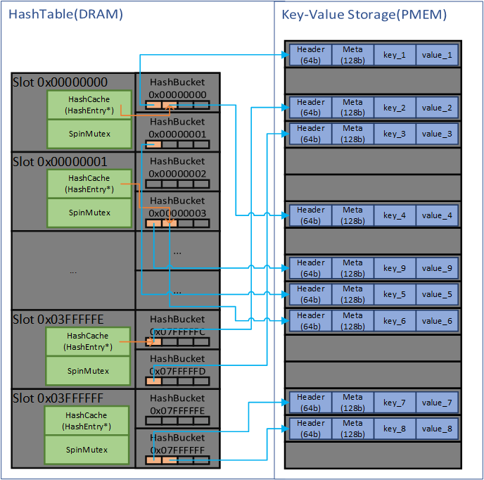
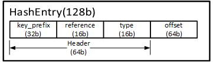
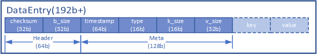
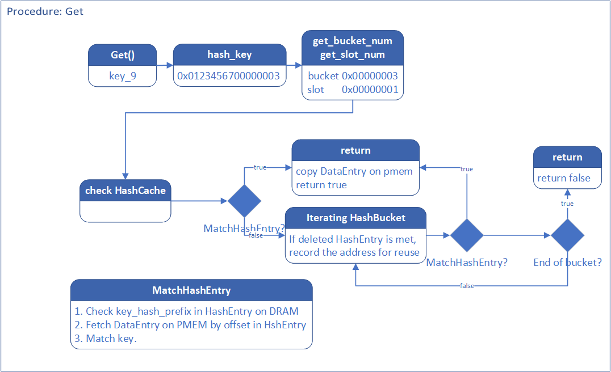
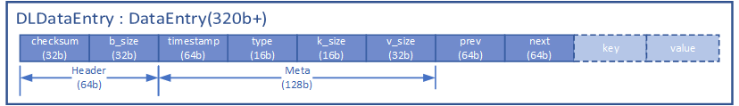

# A PMEM-Native Key-Value Store

PMEMDB是基于Persistent Memory(PMEM)实现的的高性能持久化KV存储引擎，该引擎在有接近DRAM的高读写性能的同时保证数据写入的持久性以及原子性。

目前已实现基于Hash索引的基本读写操作($1)、有序索引结构(skiplist)以及前缀搜索($2)，后续将进一步实现对多版本访问(Snapshot)、事务、备份的支持。

下文分别介绍该引擎的基本架构，读写操作的实现，在并发读/写场景下的性能测试，以及待实现功能的设计。

<!---
内存管理的部分单独分一节来讲
-->

## 1. Hash-based key-value engine
- PMEMDB支持最基本的string的Key-Value对的存取。因此PMEMDB支持存储任何可序列化的对象。

### 1.1 Architecture

- PMEMDB中所有Key-Value Pair(KV-Pair)均持久化存储在PMEM上，每一个KV-Pair存储为一个DataEntry，其地址由DRAM中的HashTable记录，每一个Key对应一个HashEntry存储在HashTable上，记录了KV-Pair在PMEM上的地址和一些其他信息。

- 图1-1是PMEMDB的主要架构，分为DRAM数据索引和PMEM持久化存储两部分。

- DRAM中的内容不会被持久化，在每次开机时通过遍历PMEM上的数据重建。

<!---

-->
|  | 
|:--:| 
| 图 1-1 |

- 以下介绍对DRAM上的HashTable和PMEM上的Key-Value Storage两部分的实现。

### 1.1.1 HashTable in DRAM

- DRAM中的HashTable是一个细粒度的散列表，记录了KV-Pair在PMEM上的地址。

#### 1.1.1.1 HashEntry
- 每一个Key依据其64bit的hash对应一个HashEntry。HashEntry上有key_prefix, reference, type, offset四个字段。

  - key_prefix：Key的hash的32 bits前缀，用于在搜索时比较。搜索某一特定Key的具体流程将在下文中介绍。
  - type：用于标记该HashEntry所对应KV-Pair的类型。该类型用于记录该KV-Pair是否已被删除，未被删除的KV-Pair的HashEntry的type为STRING_DATA_RECORD，被删除的KV-Pair的HashEntry的type为STRING_DELETE_RECORD。HashEntry还具有其他类型，用于标明string以外其他类型的数据的存储，见2.1.1。
  - reference：该key在PMEM上当前存在的不同版本DataEntry的数量，用于判断是否可以回收STRING_DELETE_RECORD的空间。具体将在1.2.5中介绍。
  - offset：KV-Pair(实际为Record，将在下文1.1.2中介绍)在PMEM上的地址。

|  | 
|:--:| 
| 图 1-2 |

#### 1.1.1.2 HashBucket
- HashEntry存放于HashBucket中，每个HashBucket中存放着具有共同N位后缀的HashEntry，参数N默认为27。

- 图1-1中最后一个HashBucket的地址0x7FFFFFF==2^27-1。该参数可以在初始化KV引擎时配置。N越大占据的DRAM空间越大，但能减少哈希冲突缩短索引的时间。

  - HashBucket内部采用数组的单链表来存储HashEntry。相较于单链表能节省一部分指针的空间并减少跳转。HashBucket中每一个数组的大小可以在初始化KV引擎时配置。图1-3中每个数组固定大小为3，默认为7。

  - 总的来说，在该HashTable中，实际使用的hash相当于原先的hash函数返回的64位hash的后N位(默认N=27)，并通过拉链法解决哈希冲突。hash的前32位存储于HashEntry的key_prefix字段中并在搜索特定Key时被使用。

|  | 
|:--:| 
| 图 1-3 |

#### 1.1.1.3 Slot

- 数个HashBucket在逻辑上被划分在一个Slot中。Slot是locking和caching的基本单元。
- 每个Slot中有M个HashBucket，默认值M=16，图1-4中M=2。
- 每个Slot中有一个HashCache字段和一个SpinMutex字段。
  - HashCache中存储一个HashEntry的指针，该指针指向最后一次读或写入KV-Pair时该Key所对应的的HashEntry。每次搜索Key时会先检查该HashEntry再遍历HashBucket。
  - SpinMutex是一个自旋锁。在写入可能从属于该Slot的Key的时候会加锁——包括更新、删除已有的KV-Pair或插入新的KV-Pair，只要该Key的hash所落在的HashBucket从属于该Slot就会加锁，例如删除某一实际不存在但会落入该Slot的Key时会加锁——在读的时候不会加锁。
  - 因为加锁粒度很小，多数时候不会发生锁争用，因此使用自旋锁来避免加锁时的用户态/内核态切换。

|  | 
|:--:| 
| 图 1-4 |

### 1.1.2 Key-Value Storage on PMEM

- PMEM空间以memory map的方式映射为文件，这一空间由PMEMAllocator负责分配、回收、整理。

<!---
涉及Sorted的部分还是放在后文比较好。
-->

- KV-Pair及其相关信息在PMEM上以Record格式存储，Record中包括DataEntry和KV-Pair，DataEntry(或DLDataEntry)包括Header、Meta两部分。KV-Pair放在DataEntry(或DLDataEntry)字段的后面。
- Header由checksum和b_size两个字段组成，主要用于PMEM空间的管理。
    - checksum：由DataEntry上的Meta和KV-Pair部分的数据计算出的checksum，用于校验数据完整性。PMEM只能保证8Byte原子写入，如果在写入过程中断电可能会留下不完整的数据，因此需要在重启时使用checksum校验数据完整性来保证整个KV-Pair的原子写入
    - b_size：DataEntry实际占用的空间，一个block为64Byte。block是PMEM读写时的基本单元，类似于读写DRAM时的cache-line。
- Meta
    - timestamp：一个全局时间戳，作为KV数据的版本号，用于在recovery时判断数据新旧以及实现snapshot机制。Timestamp直接利用CPU的TSC (Time Stamp Counter) 获取，TSC能提供指令级时间戳，随CPU时钟自动增加，相比使用全局原子变量作为时间戳而言开销极低。
    - type：Record的类型，与HashEntry的类型一致。有 STRING_DATA_RECORD, STRING_DELETE_RECORD两类。
        - STRING_DATA_RECORD是一般的DataEntry，新插入的KV-Pair均为DATA_RECORD类型。
        - STRING_DELETE_RECORD是一类特殊的Record，被删除的Key在HashTable中对应的DataEntry的type会被更新为STRING_DELETE_RECORD，并在PMEM中放入type为STRING_DELETE_RECORD的DataEntry。STRING_DELETE_RECORD用于在断电重启时恢复原来的数据。

Record，即DataEntry连同后面的KV-Pair在PMEM上的layout如图1-5所示。

| | 
|:--:| 
| 图 1-5 |

- 无论是更新还是删除已有的Record，PMEMDB总是会先在PMEM上写入更新后的Record(删除时写入一条STRING_DELETE_RECORD)，然后再更新HashTable上的HashEntry，并释放原先Record的空间，这样保证了数据的完整性。

## 1.2 Hash Operations on PMEMDB
- 1.2.1和1.2.2中的两个操作是Get和Set中共用的操作，由两个辅助函数实现，用户不会直接调用。

### 1.2.1 Search a HashEntry in HashTable by key hash

- 这一步是插入、更新和删除特定Key时共用的一步，根据特定的Key找出其在HashTable上的HashEntry，由HashTable::Search函数执行。
- 查找某一特定Key所对应的HashEntry时，
<!---Mysterious comment for formatting--->
    1. 首先计算出Key对应的64位的hash值，根据hash的N位(默认N=27)后缀索引出其HashEntry所在的HashBucket。
    2. 检查该HashBucket所从属的Slot中的HashCache所指向的HashEntry是否对应该Key。如对应，则返回该HashEntry的地址和拷贝。否则执行#3。
    3. 遍历该HashBucket搜索key_prefix相一致的HashEntry。直到找到对应该Key的HashEntry，将该Slot中的HashCache指向这一HashEntry，并返回true并通过指针返回该HashEntry的地址和拷贝，如果遍历整个HashBucket后未找到满足条件的HashEntry，则返回false。
  - 在遍历过程中，如果遇到一个可复用的HashEntry（在删除某一KV-Pair时其HashEntry的type会被标记为delete，其在PMEM上的DataEntry也不会被删除），该HashEntry的地址会被记录，并在下次该HashBucket中插入新的HashEntry时复用该地址，同时删除原有HashEntry所对应的DataEntry在PMEM上占用的所有空间。HashEntry可复用的条件将在1.2.5中介绍。

- 检查某一Key是否与特定HashEntry一致时，首先检查该HashEntry的key_prefix是否与该Key的hash一致。如一致，通过该HashEntry所记录的offset访问PMEM上的KV-Pair，检查与被查询的Key是否一致。
  - 第一步仅仅访问DRAM，只有key_prefix一致时才会访问PMEM上的KV-Pair，这一步的时间开销较大。

|  | 
|:--:| 
| 图 1-4 |

### 1.2.2 Update a HashEntry
- 这一步是插入、更新和删除特定Key时共用的一步，用于在HashTable特定位置写入HashEntry，可用于更新已有的HashEntry或在新分配的空间上写入HashEntry，由HashTable::Insert函数执行。
- 更新或插入某一特定Key所对应的HashEntry时，
<!---Mysterious comment for formatting--->
    1. 根据Key的hash计算出该HashEntry所从属的bucket和slot。
    2.1. 如果是更新特定的Key，则更新原有的HashEntry。先拷贝原有的HashEntry，再写入offset指向新的Record(STRING_HASH_RECORD或STRING_DELETE_RECORD)的新HashEntry，最后根据拷贝Free原来HashEntry所对应的Record。该顺序保证了数据的合法性。
    2.2. 如果是插入新的Key，则可能复用被删除的HashEntry的空间，或是使用新分配的空间。如果该空间属于由1.2.1中HashTable::Search扫描HashTable时记录的可复用的HashEntry，则在写入新HashEntry前Free PMEM上旧HashEntry对应的Record所占用的空间。接着会在被复用或新分配的空间上写入新的HashEntry。

### 1.2.3 Get

- 读操作分为以下步骤：

<!---
Escape symbol :: below
--->
    1. 调用HashTable::Search函数，找到特定Key所对应的HashEntry并对其进行拷贝。若未找到则从返回Status::NotFound。
    2. 从拷贝的HashEntry调取Record在PMEM上的offset，并拷贝其中Value的部分。
    3. 检查拷贝的HashEntry与HashTable上的HashEntry是否一致。如不一致，说明发生了更新或删除操作更改了原先的HashEntry，则重新拷贝HashTable上的HashEntry，重复2、3。如一致，说明成功读取了PMEM上的KV-Pair，则返回Status::Ok。

- 调用Get不会对Slot加锁，避免了在热点访问场景下的锁冲突。这里之所以可以无锁访问，是因为HashEntry中的offset和Header均可以8字节原子访问(？尚未使用std::atomic)。在读取Record后通过检查HashTable上的HashEntry与拷贝的HashEntry是否一致，如不一致则重新读取，我们保证了读取过程中该HashEntry未被修改。

### 1.2.4 Set
- 当不存在该Key对应的旧的Record时，PMEMDB中的Set操作在PMEM中插入一条新的Record，并在HashTable中插入对应该Key的HashEntry，其offset指向新的Record。如果插入新HashEntry时复用了被Delete的Key的HashEntry的空间，则释放被复用HashEntry对应的Record所占据的PMEM空间。
- 当存在该Key对应的旧的Record时，PMEMDB中的Set操作在PMEM中插入一条新的Record，并更新HashTable中对应该Key的HashEntry，使其offset指向新的Record，同时Free原有的Record所占据的PMEM空间。

- Set操作分为以下步骤：
<!---Mysterious comment for formatting--->
    1. RAII获取该Key在HashTable上从属的Slot的自旋锁。该自旋锁仅影响插入、更新和删除操作(Set&Delete)。
    2. 调用HashTable::Search函数，找到特定Key所对应的HashEntry并对其进行拷贝。
    3. 调用PMEMAllocator为新的Record分配空间。插入新的Record和更新已有的Record都是在PMEM上新分配的地址上操作的。
    4. 获得当前timestamp，如果该timestamp比已有的Record的timestamp旧，则放弃更新操作，Free已分配的PMEM的空间。返回Status::Okay。
    5. 调用PersistDataEntry写入Record。依次写入DataEntry(包含b_size、timestamp、type、k_size、v_size信息)、Key、Value三项。再根据Key的hash计算出checksum写入DataEntry中的checksum字段。这样保证只有完整的Record才具有合法的checksum。
    6. 调用HashTable::Insert插入或更新HashTable中对应该Record的HashEntry。此时会Free旧的Record的空间。
    7. RAII释放该Slot的自旋锁。

- 如果写入时系统发生断电，未写入完整的Record，重启后Recover时会检查checksum。这样能保证如果存在合法的Record，那么PMEMDB恢复出来的一定是最新的Record及其HashEntry。
- 被Free的PMEM空间会被交给PMEMAllocator处理，上面的数据并不会立即被清除，但是随时可能被写入新的Record覆盖。

### 1.2.5 Delete
- Delete与Set操作类似，共用了大部分的代码。
- 当Delete不存在或已删除的Key时，直接返回Status::Okay。
- 当存在该Key对应的旧的Record时，PMEMDB中的Set操作在PMEM中插入一条新的Record，即STRING_DELETE_RECORD，并更新HashTable中对应该Key的HashEntry，使其offset指向新的Record，同时Free原有的Record所占据的PMEM空间。

- Delete操作分为以下步骤：
<!---Mysterious comment for formatting--->
    1. RAII获取该Key在HashTable上从属的Slot的自旋锁。该自旋锁仅影响插入、更新和删除操作(Set&Delete)。
    2. 调用HashTable::Search函数，找到特定Key所对应的HashEntry并对其进行拷贝。如果未找到相应HashEntry或该HashEntry的type为STRING_DELETE_RECORD，说明该Key不存在或已被删除，直接返回Status::Okay。
    3. 调用PMEMAllocator为新的Record分配空间。
    4. 获得当前timestamp，如果该timestamp比已有的Record的timestamp旧，则放弃更新操作，Free已分配的PMEM的空间。返回Status::Okay。
    5. 调用PersistDataEntry写入Record。依次写入DataEntry(包含b_size、timestamp、type、k_size、v_size信息)、Key、Value三项。再根据Key的hash计算出checksum写入DataEntry中的checksum字段。这样保证只有完整的Record才具有合法的checksum。
    6. 调用HashTable::Insert更新HashTable中对应该Record的HashEntry。此时会Free旧的Record的空间。
    7. RAII释放该Slot的自旋锁。

- 当Delete一个存在Record的Key时，HashTable中该Key对应的HashEntry的type会被标记为STRING_DELETE_RECORD，但这一HashEntry并不会立即被复用。
    - HashEntry中的reference记录了历史版本的Record的数量，新插入的Key的reference为1，每次更新该Key时reference会递增1。
    - 更新时Free历史版本Record时reference不会立即更新。只有PMEMAllocator将历史版本Record占用的空间分配给其他Record使用，覆盖了原先的Record后，该reference的计数会减去1。
    - 删除该Key时不会更新reference计数。
    - 当HashEntry中reference归零且type为STRING_DELETE_RECORD时，该HashEntry的空间被允许复用，此时才会Free该STRING_DELETE_RECORD所占用的PMEM空间。这样保证了在Recover时如果该Key处于被删除的状态，那么能通过STRING_DELETE_RECORD恢复出该状态，或者PMEM上不存在该Key相关的Record，不会出现STRING_DELETE_RECORD的空间被复用导致恢复出该Key的历史版本的情形。

### 1.2.6 Recovery

- 系统在启动时重建HashTable和PMEMAllocator，多个线程以Segment为单位遍历PMEM上的DataEntry。Segment是PMEMAllocator分配空间的最大粒度。步骤为：

1. 线程请求一块Segment。如果所有Segment被遍历完，则Recovery完成。
2. 按照PMEM上分配空间的最小粒度block遍历Segment，尝试读取Record，并根据checksum检验是否是合法的Record。
3. 搜索HashTable查看是否已存在相同的Key，如果该Record比历史版本新则更新HashTable。较旧版本的Record所有的PMEM空间将被Free。
4. 扫描该Segment上的其他Record。如果该Segment被遍历完则返回1。

- Recovery结束时记录下当前最大timestamp，后续数据的timestamp以该timestamp为基础增加。timestamp是自PMEMDB创建以来的总CPU cycle。

# 2. PersistentList
- PMEMDB支持存储PersistentList。PersistentList是持久化在PMEM上的集合数据结构。PersistentList分为Skiplist和后续会实现的Hashlist。
- Skiplist是有序的集合，使用了带双向链表的skip list数据结构。支持对Skiplist内元素的读写、删除操作，同时支持前缀搜索、对Skiplist全体或部分元素进行顺序或逆序遍历的操作。
- Hashlist是无序的集合，使用了双向链表数据结构。支持对Hashlist内元素的读写、删除操作，同时支持对Hashlist内全体元素进行遍历的操作。

## 2.1 Skiplist Architecture
- Skiplist使用了和1.1中描述相同的架构，但是在PMEM Storage中的DataEntry上加入了前驱prev与后继next两个字段，从而将Record的排序也持久化记录到PMEM上。
- 每一个Skiplist是一个PersistentList，该PersistentList以其名称list_name和特有的id组成KV-Pair被持久化存储于PMEM上(下文记作HeaderRecord，区别于一般的Record)。用户通过list_name来访问该PersistentList及其中的元素。
- Skiplist的id和其中元素的Key(下文记作UserKey)拼接起来组成实际存储在PMEM上Key-Value Storage中的SkiplistKey。按照UserKey访问特定Skiplist中的特定SkiplistKey时，首先根据Skiplist的list_name以类似1.2.3中Get函数的方式访问HeaderRecord，读取其id，再由id和UserKey拼接为SkiplistKey，再以类似1.2中的Get、Set和Delete函数类似的方式读取、修改、删除存储于PMEMDB上的Record。

### 2.1.1 HashTable of Skiplist in DRAM
- 同1.1.1。Skiplist中的元素以完全一样的方式被HashTable索引。
- Skiplist的list_name和id组成的KV-Pair也被HashTable索引。
- PMEMDB中Skiplist的元素和其本身list_name所对应的HashEntry与最基本的string的KV-Pair的HashEntry共同存放于同一个HashTable内，但三者具有不同的类型。
    - String的类型的Record对应的HashEntry的type为STRING_DATA_RECORD或STRING_DELETE_RECORD。
    - Skiplist中的元素的Record对应的HashEntry的type为SORTED_DATA_RECORD或SORTED_DELETE_RECORD。未被删除的KV-Pair的HashEntry的type为SORTED_DATA_RECORD，被删除的KV-Pair的HashEntry的type为SORTED_DELETE_RECORD。
    - Skiplist本身的list_name和id组成的KV-Pair对应的HashEntry的type为SORTED_HEADER_RECORD。目前不支持删除或更新Skiplist本身，只能删除Skiplist中的元素。

### 2.1.2 Key-Value Storage of Skiplist on PMEM

- Skiplist的Record(SORTED_RECORD)以类似一般String的Record(STRING_RECORD)的形式存储与PMEM上。但与STRING_RECORD不同，STRING_RECORD头部不再是DataEntry而是DLDataEntry(Doubly Linked DataEntry)，相较于DataEntry多了prev和next字段用于记录排序的信息。
- DLDataEntry中的Header和Meta字段与DataEntry几乎一致，区别在于checksum的算法略有不同，以及type不同。
    - type：Record的类型，与HashEntry的类型一致。有SORTED_DATA_RECORD, SORTED_DELETE_RECORD两类。
        - SORTED_DATA_RECORD是一般的DataEntry，新插入的KV-Pair均为SORTED_DATA_RECORD类型。
        - SORTED_DELETE_RECORD是一类特殊的Record，被删除的Key在HashTable中对应的DataEntry的type会被更新为SORTED_DELETE_RECORD，并在PMEM中放入type为SORTED_DELETE_RECORD的DataEntry。SORTED_DELETE_RECORD用于在断电重启时恢复Skiplist中的数据。
        - SORTED_HEADER_RECORD是一类特殊的Record，记录Skiplist本身的list_name和id，并且在其next域内存储Skiplist内第一个元素的在PMEM上Record的offset。
    - prev, next：记录前驱和后继的offset的指针，用于将单个Skiplist上的Record排序并持久化。

- Record，即DLDataEntry连同后面的KV-Pair在PMEM上的layout如图2-2所示。

| | 
|:--:| 
| 图 2-2 |

### 2.1.3 Skip list in DRAM
- Skip list(指具体的数据结构)是Skiplist(指每一个存放复数个元素的集合)上特有的数据结构，是一个单链表连接的跳转表，用于快速查找，存储于DRAM上。
- Skip list数据结构参照图2-3。

| | 
|:--:| 
| 图 2-3 |

- PMEM上每一条Record对应一个SkiplistNode存储于DRAM上，该SkiplistNode内存储了指向下一个节点的塔std::atomic<SkiplistNode*> next[]，塔的高度height，以及用于快速比较的cached_key及其大小cached_key_size，和该SkiplistNode所对应的Record的地址DLDataEntry* data_entry。

## 2.2 Operations on Skiplist in PMEMDB
- Skiplist基本的读取SGet、写入SSet和删除SDelete操作和针对STRING_RECORD的Get、Set和Delete操作类似，但因为要维护DRAM上的skip list所以步骤上会更加复杂。
- 访问Skiplist上的元素时，首先会根据Skiplist自身的名称list_name访问其在PMEM上持久化存储的HeaderRecord(2.1.1)，读取其id。再将id与Skiplist中元素的UserKey拼接组成SkiplistKey，再按照类似1.2中的逻辑访问该元素。
- 2.2.1是辅助函数，为SGet、SSet、SDelete共用。用户不会调用。

### 2.2.1 Search for HeaderRecord on HashTable
- HeaderRecord(2.1.1)是Skiplist的入口。通过函数KVEngine::SearchOrInitSkiplist获取Skiplist的地址。
- 当该Skiplist存在时，返回PMEM上HeaderRecord的地址。返回Status::Ok。
- 当该Skiplist不存在时，在SSet和SDelete中，会在PMEM上写入新的HeaderRecord并生成id，返回其地址。返回Status::Ok。
- 通过SGet试图访问不存在的Skiplist中的元素时，不会生成新的Skiplist。返回Status::NotFound。

### 2.2.2 Seek for a key on skip list
- Seek函数返回Splice结构，Splice是一个记录位置的结构，处于skip list的两个tower的中间位置，记录着前后两个tower对应的DLDataEntry的地址以及该位置在不同高度下前后两个tower所对应的SkiplistNode的地址。
- 当Seek的SkiplistKey存在时，返回的Splice处在该SkiplistKey之后的位置。
- 当Seek的SkiplistKey不存在时，返回的Splice处在该Skiplist应该被插入的前后两个节点之间的位置。

### 2.2.3 SGet
- 用户按照特定Skiplist的名称list_name访问特定UserKey时，
<!---
Escape symbol :: below
--->
    1. 调用KVEngine::SearchOrInitSkiplist获取Skiplist的地址。如该函数返回Status::Ok以外的状态，则直接将该状态返回给Caller处理。
    2. 根据Skiplist在PMEM上的SORTED_HEADER_RECORD的地址读出该Record上记录的Skiplist的id。将该id与UserKey拼接为SkiplistKey。
    3. 调用KVEngine::Get的底层实现KVEngine::HashGetImpl读取SkiplistKey对应的Record上的Value。

- 调用SGet不会对Slot加锁，避免了在热点访问场景下的锁冲突。

### 1.2.3 SSet

- SSet操作分为以下步骤：
<!---Mysterious comment for formatting--->
    1. 调用KVEngine::SearchOrInitSkiplist获取Skiplist的地址。如该函数返回Status::Ok以外的状态，则直接将该状态返回给Caller处理。
    2. 根据Skiplist在PMEM上的SORTED_HEADER_RECORD的地址读出该Record上记录的Skiplist的id。将该id与UserKey拼接为SkiplistKey。
    3. 为新插入或要更新的Record分配PMEM空间。
    4. RAII获取该SkiplistKey在HashTable上从属的Slot的自旋锁。该自旋锁仅影响插入、更新和删除操作(SSet&SDelete)。
    5. 调用HashTable::Search函数，找到特定Key所对应的HashEntry并对其进行拷贝。该HashEntry将在写入新的Record后被更新。
    6. 获得当前timestamp，如果该timestamp比已有的Record的timestamp旧，则放弃更新操作，Free已分配的PMEM的空间。返回Status::Okay，RAII释放自旋锁。
    7. 如未找已有的Record，则调用2.2.2中的Seek找到应插入该Record的位置，记录于Splice中。如已找到，则将Splice置于该Record后方的位置。
    8. 根据Splice对插入位置的前后两个Record对应的HashEntry从属的Slot加自旋锁。
    9. 将新的Record写入PMEM上，在skip list中插入相应的SkiplistNode。插入时对前驱后继的更新使用了原子操作，无需加锁。
    10. 调用HashTable::Insert插入或更新HashTable中对应该Record的HashEntry。此时会Free旧的Record的空间。
    11. 释放前驱后继的自旋锁，RAII释放该Slot的自旋锁。

### 1.2.5 SDelete
- SDelete与SSet操作类似，共用了大部分的代码。
- 当试图SDelete不存在的Skiplist中的元素或Skiplist中不存在的元素时，会直接返回。
- 删除存在的Skiplist中的元素时，等同于通过SSet写入一条SORTED_DELETE_RECORD。

### 2.2.6 Recovery

Skiplist的Recovery流程和1.2.6类似，但需要对SORTED_RECORD做特殊处理：
1. 对每个SORTED_RECORD，需查看其前驱、后继结点的next、prev指针是否均指向自己，判断该结点是否有效
2. HashTable重建完成后，遍历每个Skiplist中的元素重建DRAM中的skip list。

