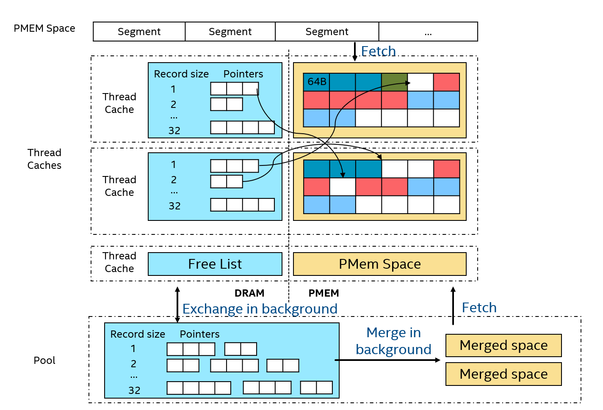

## 结构

- PMEM Space: 从PMEM map出的一块空间，分为若干segment，每个segment又分成若干blocks，block是allocator的最小分配单元
- Thread caches：为前台线程cache一些可用空间，避免线程竞争。包括一段segment和一个free list。Free list管理被释放的空闲空间，是一个链表的数组，每个链表结点是一个指向空闲空间的指针，链表的数组下标表示结点指针指向的空闲空间的大小，即包含多少个block。
- Pool：为了均衡各thread cache的资源，由一个后台线程周期地将thread cache中的free list以及segment移动到后台的pool中，pool中的资源由所有前台线程共享。

## 空间分配流程：
- 线程查看cache的segment是否有足够空间，若无，则从pool中拿取另一个segment。然后从segment末尾分配空间。
- 若pool中仍无可用segment，则尝试从free list中分配空间。首先查看cache的free list，若无可用空间，则从pool中拿取另一段free list。
- 若从free list分配空间仍然失败，则从PMEM Space中fetch一段新的segment

## 空间释放：
	- 将free的空间指针加入cache中对应大小的free list链表
	
## 碎片合并：
	- 尚未画出